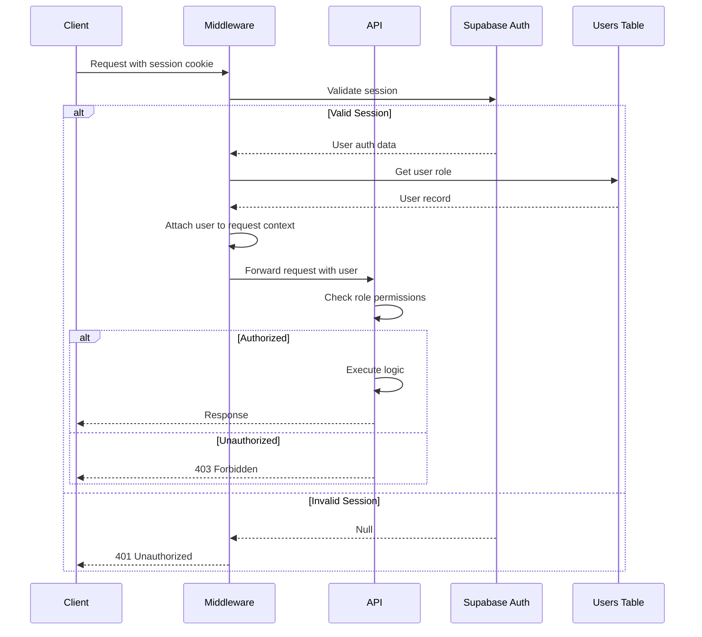

# Backend Architecture

## Service Architecture (Serverless Functions)

**Function Organization:**

Each API route is a standalone serverless function deployed on Vercel. Functions are organized by resource (employees, columns, etc.) with nested routes for specific actions.

**Function Template:**

```typescript
// app/api/employees/route.ts
import { NextRequest, NextResponse } from 'next/server';
import { createRouteHandlerClient } from '@supabase/auth-helpers-nextjs';
import { cookies } from 'next/headers';
import { employeeService } from '@/lib/server/services/employee-service';
import { getUserFromSession } from '@/lib/server/auth';

export async function GET(request: NextRequest) {
  try {
    const supabase = createRouteHandlerClient({ cookies });
    const user = await getUserFromSession(supabase);

    if (!user) {
      return NextResponse.json(
        { error: { code: 'UNAUTHORIZED', message: 'Authentication required' } },
        { status: 401 }
      );
    }

    const { searchParams } = new URL(request.url);
    const includeArchived = searchParams.get('includeArchived') === 'true';
    const includeTerminated = searchParams.get('includeTerminated') === 'true';

    const employees = await employeeService.getAll(user.role, {
      includeArchived,
      includeTerminated,
    });

    return NextResponse.json({ data: employees });
  } catch (error) {
    console.error('GET /api/employees error:', error);
    return NextResponse.json(
      { error: { code: 'INTERNAL_ERROR', message: 'Failed to fetch employees' } },
      { status: 500 }
    );
  }
}

export async function POST(request: NextRequest) {
  try {
    const supabase = createRouteHandlerClient({ cookies });
    const user = await getUserFromSession(supabase);

    if (!user || user.role !== 'hr_admin') {
      return NextResponse.json(
        { error: { code: 'FORBIDDEN', message: 'HR Admin access required' } },
        { status: 403 }
      );
    }

    const data = await request.json();
    const employee = await employeeService.create(data);

    return NextResponse.json({ data: employee }, { status: 201 });
  } catch (error) {
    console.error('POST /api/employees error:', error);
    return NextResponse.json(
      { error: { code: 'VALIDATION_ERROR', message: error.message } },
      { status: 400 }
    );
  }
}
```

## Database Architecture

### Data Access Layer (Repository Pattern)

```typescript
// lib/server/repositories/employee-repository.ts
import { SupabaseClient } from '@supabase/supabase-js';
import type { Employee, EmployeeFormData } from '@/lib/types/employee';

export class EmployeeRepository {
  constructor(private supabase: SupabaseClient) {}

  async findAll(filters?: { includeArchived?: boolean; includeTerminated?: boolean }): Promise<Employee[]> {
    let query = this.supabase
      .from('employees')
      .select('*')
      .order('surname', { ascending: true });

    if (!filters?.includeArchived) {
      query = query.eq('is_archived', false);
    }

    if (!filters?.includeTerminated) {
      query = query.eq('is_terminated', false);
    }

    const { data, error } = await query;

    if (error) {
      throw new Error(Failed to fetch employees: );
    }

    return data;
  }

  async findById(id: string): Promise<Employee | null> {
    const { data, error } = await this.supabase
      .from('employees')
      .select('*')
      .eq('id', id)
      .single();

    if (error) {
      if (error.code === 'PGRST116') return null; // Not found
      throw new Error(Failed to fetch employee: );
    }

    return data;
  }

  async create(employee: EmployeeFormData): Promise<Employee> {
    const { data, error } = await this.supabase
      .from('employees')
      .insert(employee)
      .select()
      .single();

    if (error) {
      if (error.code === '23505') {
        throw new Error('Duplicate SSN: An employee with this SSN already exists');
      }
      throw new Error(Failed to create employee: );
    }

    return data;
  }

  async update(id: string, updates: Partial<Employee>): Promise<Employee> {
    const { data, error } = await this.supabase
      .from('employees')
      .update(updates)
      .eq('id', id)
      .select()
      .single();

    if (error) {
      throw new Error(Failed to update employee: );
    }

    return data;
  }

  async archive(id: string): Promise<void> {
    await this.update(id, { is_archived: true });
  }

  async terminate(id: string, date: string, reason: string): Promise<void> {
    await this.update(id, {
      is_terminated: true,
      termination_date: date,
      termination_reason: reason,
    });
  }
}
```

## Authentication and Authorization

### Auth Flow



### Middleware/Guards

```typescript
// lib/server/auth.ts
import { SupabaseClient } from '@supabase/supabase-js';
import type { SessionUser, UserRole } from '@/lib/types/user';

export async function getUserFromSession(
  supabase: SupabaseClient
): Promise<SessionUser | null> {
  const {
    data: { session },
  } = await supabase.auth.getSession();

  if (!session) return null;

  const { data: user, error } = await supabase
    .from('users')
    .select('*')
    .eq('auth_user_id', session.user.id)
    .eq('is_active', true)
    .single();

  if (error || !user) return null;

  return {
    ...user,
    auth_id: session.user.id,
  };
}

export function requireRole(allowedRoles: UserRole[]) {
  return (user: SessionUser | null) => {
    if (!user) {
      throw new Error('Authentication required');
    }

    if (!allowedRoles.includes(user.role)) {
      throw new Error('Insufficient permissions');
    }

    return user;
  };
}

// Usage in API route:
// const user = requireRole(['hr_admin'])(await getUserFromSession(supabase));
```


---
