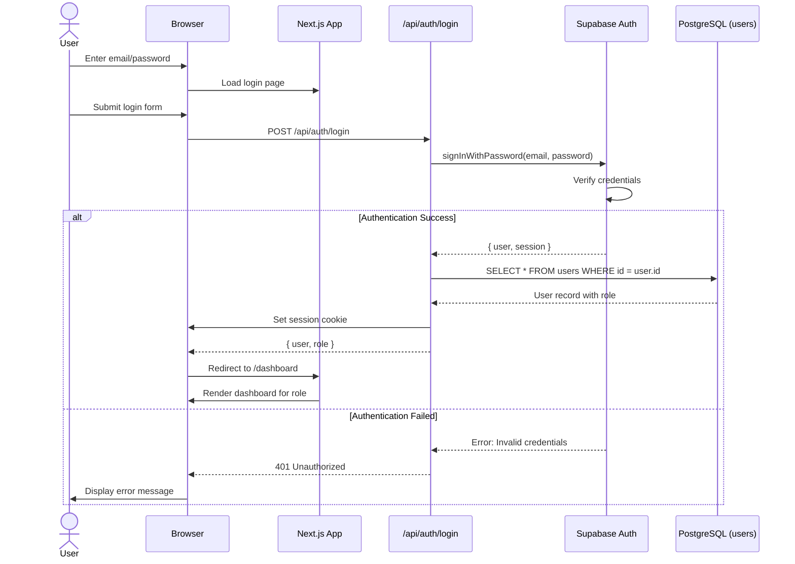
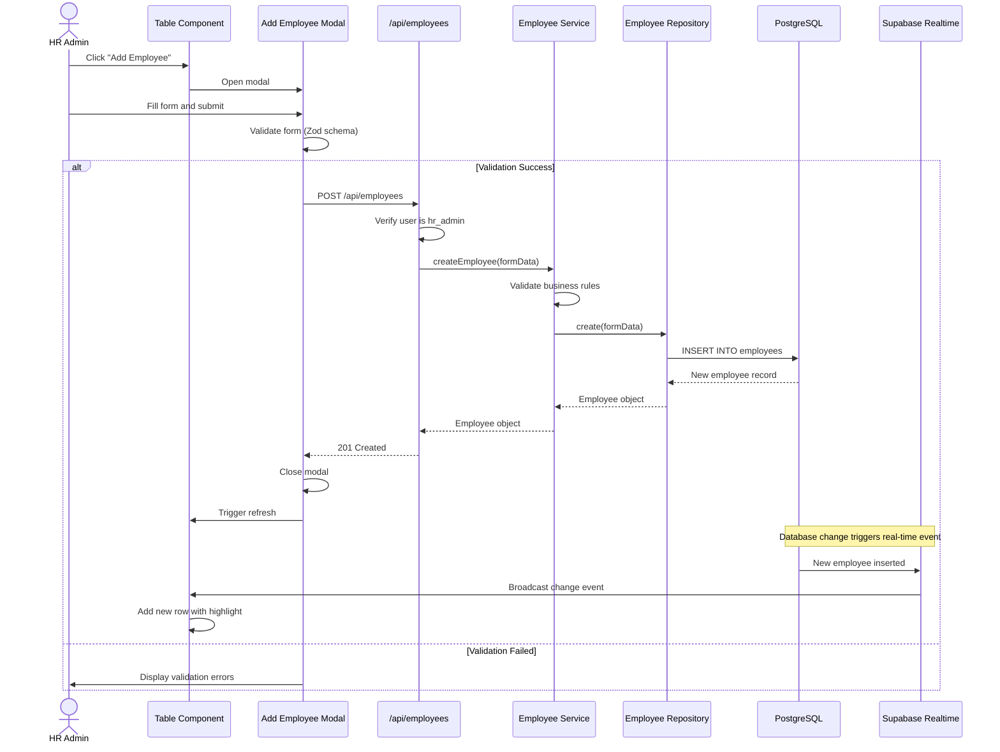
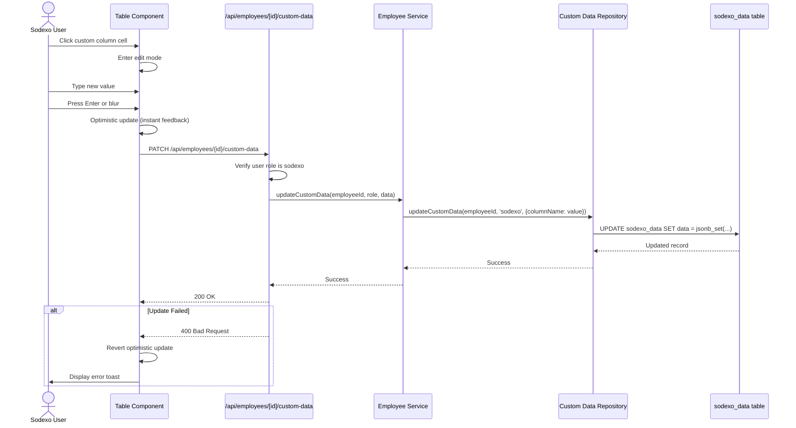
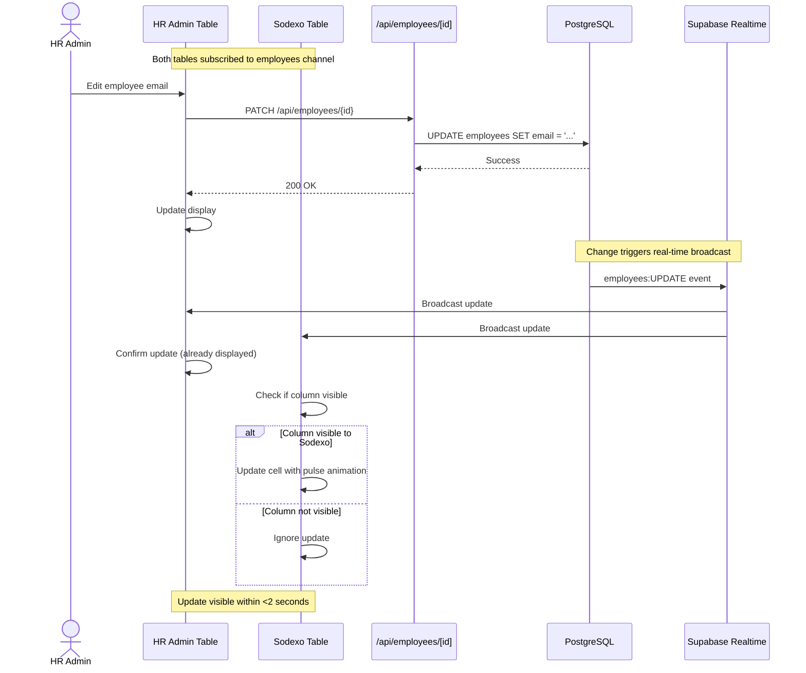
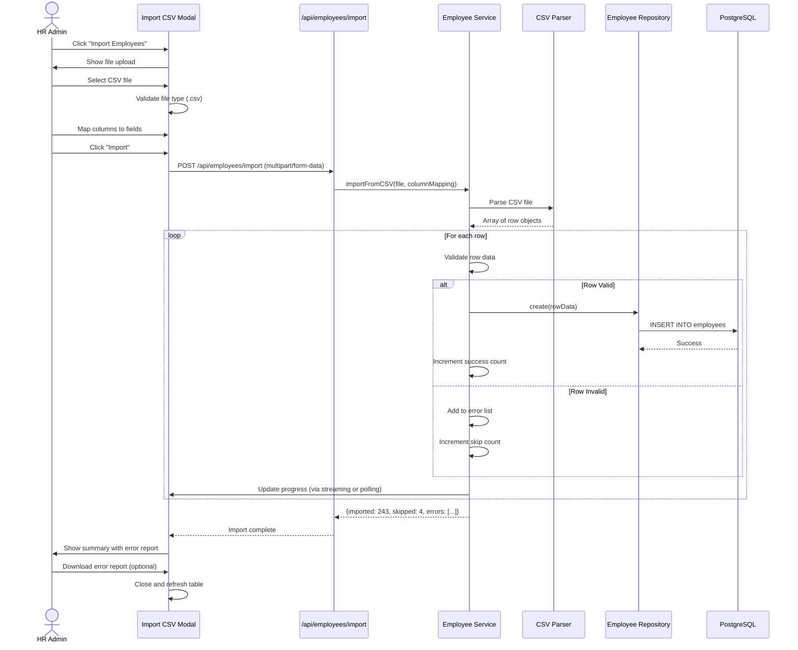
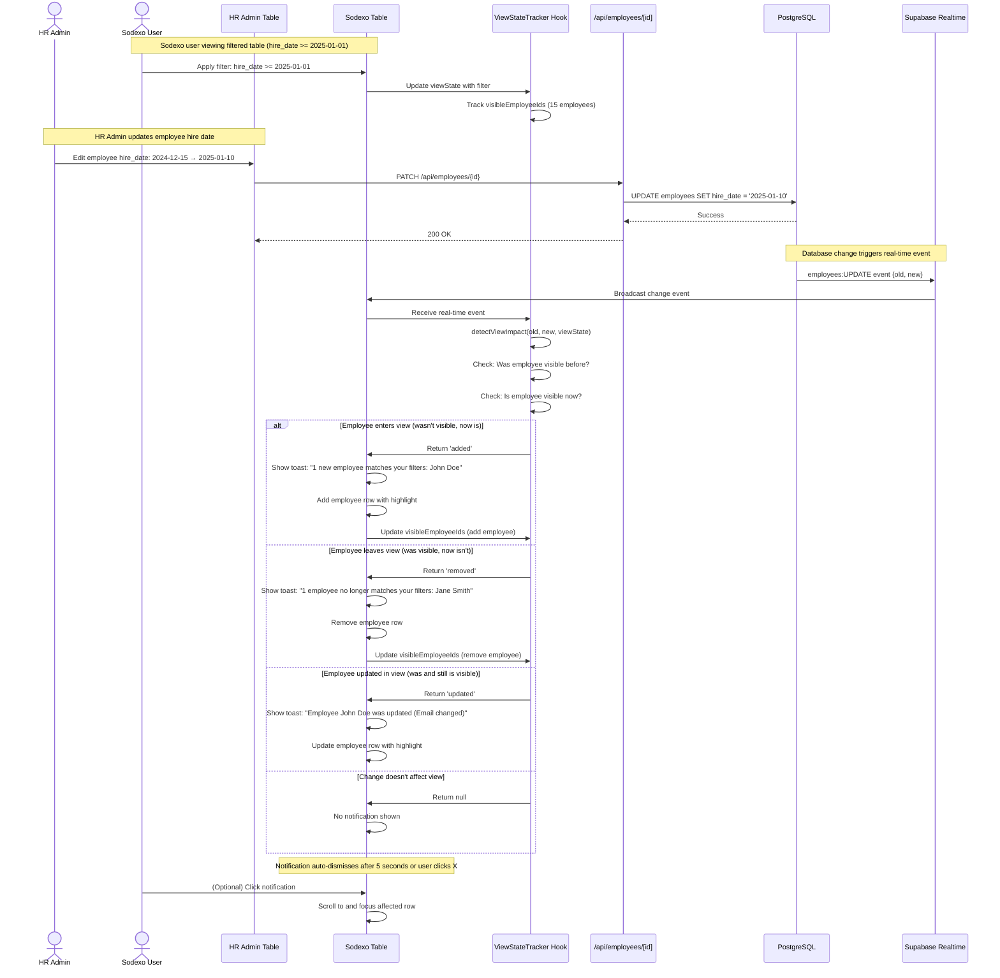

# Core Workflows

## Workflow 1: User Authentication and Session Management



## Workflow 2: HR Admin Creates Employee



## Workflow 3: External Party Edits Custom Column



## Workflow 4: Real-time Masterdata Sync



## Workflow 5: CSV Import with Error Handling



## Workflow 6: External Party Receives Change Notification



**Actor:** External Party User (Sodexo/ÖMC/Payroll/Toplux)

**Trigger:** HR Admin updates masterdata field affecting external party's filtered view

**Preconditions:**

- External party user is logged in and viewing employee table
- User has active filter or sort applied (or viewing default unfiltered view)
- Supabase real-time subscription is active

**Steps:**

1. External party user is viewing employee table with active filter (e.g., hire_date >= 2025-01-01, showing 15 employees)
2. HR Admin updates employee hire_date from 2024-12-15 to 2025-01-10 (employee now matches filter)
3. Supabase real-time broadcasts UPDATE event to all subscribed clients
4. External party's ViewStateTracker hook receives event
5. ViewStateTracker evaluates: Does employee match current filter criteria?
   - **Before change:** Employee NOT in visibleEmployeeIds set (hire_date 2024-12-15 < filter criteria)
   - **After change:** Employee DOES match filter criteria (hire_date 2025-01-10 >= 2025-01-01)
   - **Decision:** Trigger "Employee Added to View" notification
6. Toast notification appears in bottom-right: "1 new employee matches your filters: John Doe"
7. Employee row appears in table at correct sorted position (real-time sync from Story 4.5)
8. Row briefly highlights to draw attention (existing AC from Story 4.5)
9. User can:
   - Dismiss notification by clicking X
   - Wait 5 seconds for auto-dismiss
   - Optionally click notification to focus on new row (enhancement)
10. ViewStateTracker updates visibleEmployeeIds to include new employee

**Success Criteria:**

- Notification appears within 2 seconds of HR change (NFR4)
- Notification is non-intrusive and dismissible (NFR16)
- User can continue working without interruption
- Notification provides clear context about what changed

**Alternative Flows:**

**A1: Employee Removed from View**

- Step 5: Employee WAS in visibleEmployeeIds, change causes employee to NO LONGER match filter
- Step 6: Notification: "1 employee no longer matches your filters: Jane Smith"
- Step 7: Employee row disappears from table

**A2: Employee Updated in View (No Visibility Change)**

- Step 5: Employee WAS and STILL IS in visibleEmployeeIds
- Step 6: Notification: "Employee John Doe was updated (Email changed)"
- Step 7: Employee row updates in place (existing AC from Story 4.5)

**A3: Multiple Simultaneous Changes**

- HR Admin imports 10 employees via CSV (bulk operation)
- ViewStateTracker batches notifications: "10 new employees match your filters"
- Table updates with all 10 employees

**Error Handling:**

- If real-time connection drops: No notifications shown (user sees warning from Story 4.5 AC #8)
- If notification logic takes >100ms: Log performance warning (does not block table update)

---

````
```

````
