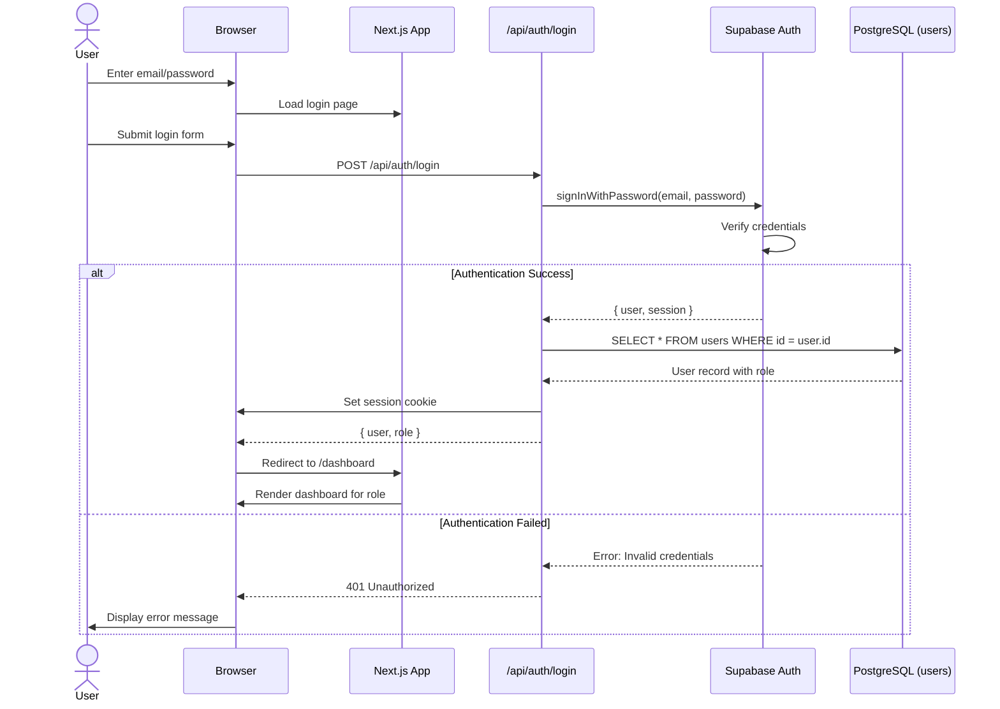
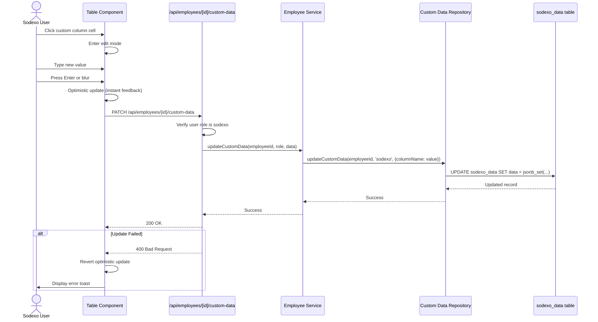
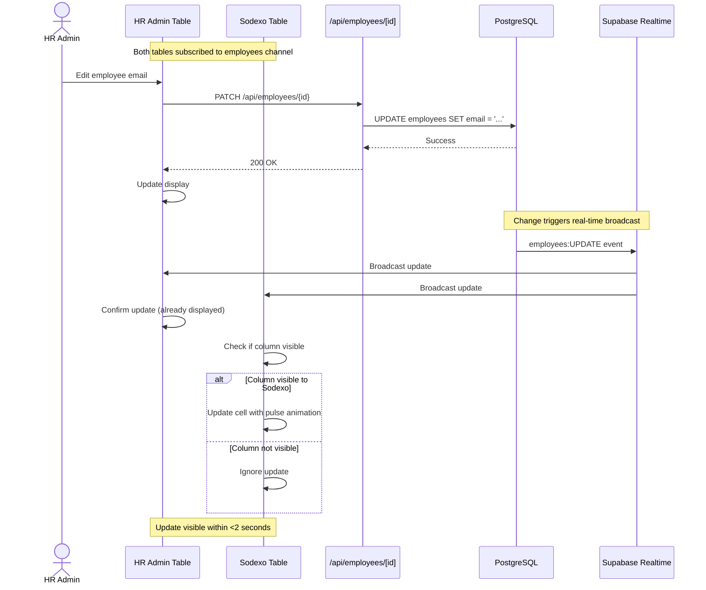
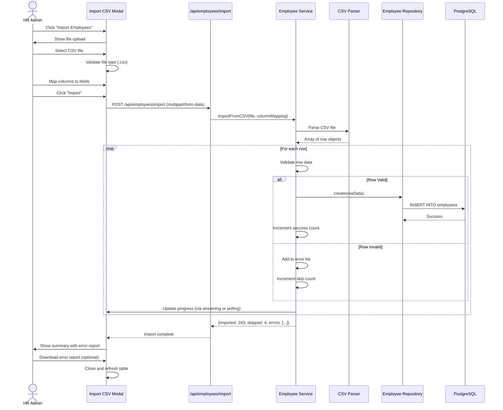

# Core Workflows

## Workflow 1: User Authentication and Session Management

## Workflow 2: HR Admin Creates Employee

```mermaid
sequenceDiagram
    actor HRAdmin as HR Admin
    participant Table as Table Component
    participant Modal as Add Employee Modal
    participant API as /api/employees
    participant Service as Employee Service
    participant Repo as Employee Repository
    participant DB as PostgreSQL
    participant Realtime as Supabase Realtime

    HRAdmin->>Table: Click "Add Employee"
    Table->>Modal: Open modal
    HRAdmin->>Modal: Fill form and submit
    Modal->>Modal: Validate form (Zod schema)
    
    alt Validation Success
        Modal->>API: POST /api/employees
        API->>API: Verify user is hr_admin
        API->>Service: createEmployee(formData)
        Service->>Service: Validate business rules
        Service->>Repo: create(formData)
        Repo->>DB: INSERT INTO employees
        DB-->>Repo: New employee record
        Repo-->>Service: Employee object
        Service-->>API: Employee object
        API-->>Modal: 201 Created
        Modal->>Modal: Close modal
        Modal->>Table: Trigger refresh
        
        Note over DB,Realtime: Database change triggers real-time event
        DB->>Realtime: New employee inserted
        Realtime->>Table: Broadcast change event
        Table->>Table: Add new row with highlight
        
    else Validation Failed
        Modal->>HRAdmin: Display validation errors
    end
```

## Workflow 3: External Party Edits Custom Column

## Workflow 4: Real-time Masterdata Sync

## Workflow 5: CSV Import with Error Handling

