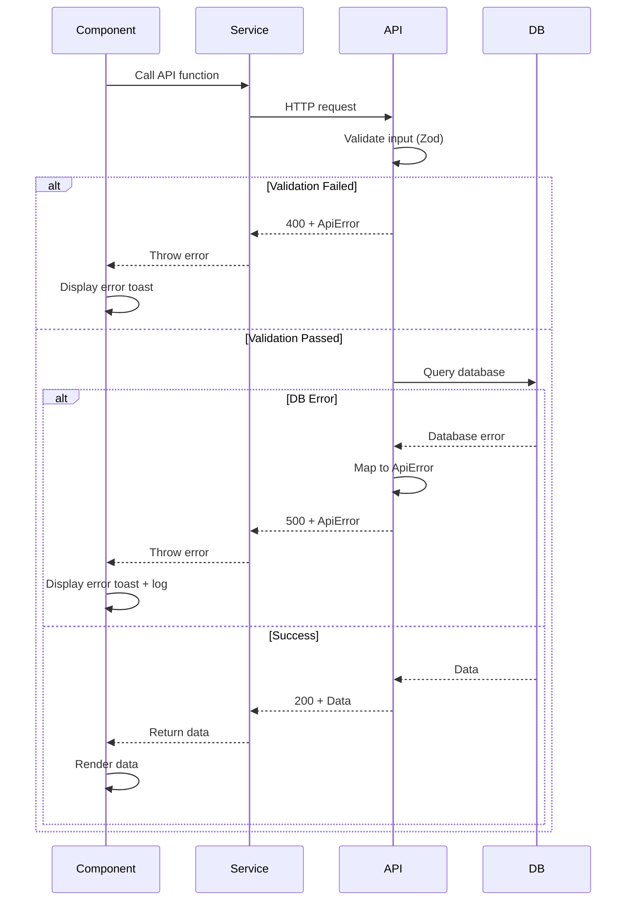

# Error Handling Strategy

## Error Flow



## Error Response Format

```typescript
// lib/types/api.ts
export interface ApiError {
  error: {
    code: string;
    message: string;
    details?: Record<string, any>;
    timestamp: string;
    requestId?: string;
  };
}

export type ApiResponse<T> = {
  data: T;
  meta?: {
    total?: number;
    page?: number;
    timestamp: string;
  };
};
```

## Frontend Error Handling

```typescript
// lib/services/api-client.ts
export async function apiRequest<T>(
  endpoint: string,
  options?: RequestInit
): Promise<T> {
  try {
    const response = await fetch(endpoint, {
      ...options,
      headers: {
        'Content-Type': 'application/json',
        ...options?.headers,
      },
    });

    if (!response.ok) {
      const errorData: ApiError = await response.json();
      throw new ApiError(errorData.error);
    }

    const result = await response.json();
    return result.data;
  } catch (error) {
    if (error instanceof ApiError) {
      throw error;
    }
    // Network error
    throw new ApiError({
      code: 'NETWORK_ERROR',
      message: 'Failed to connect to server',
      timestamp: new Date().toISOString(),
    });
  }
}

class ApiError extends Error {
  code: string;
  details?: Record<string, any>;

  constructor(error: ApiError['error']) {
    super(error.message);
    this.code = error.code;
    this.details = error.details;
  }
}
```

## Backend Error Handling

```typescript
// app/api/employees/route.ts
import { NextResponse } from 'next/server';
import { ZodError } from 'zod';

export async function POST(request: Request) {
  try {
    const data = await request.json();
    const validated = employeeSchema.parse(data);
    
    const employee = await employeeService.create(validated);
    return NextResponse.json({ data: employee }, { status: 201 });
    
  } catch (error) {
    if (error instanceof ZodError) {
      return NextResponse.json(
        {
          error: {
            code: 'VALIDATION_ERROR',
            message: 'Invalid input data',
            details: error.errors,
            timestamp: new Date().toISOString(),
          },
        },
        { status: 400 }
      );
    }

    if (error.message.includes('Duplicate SSN')) {
      return NextResponse.json(
        {
          error: {
            code: 'DUPLICATE_ENTRY',
            message: error.message,
            timestamp: new Date().toISOString(),
          },
        },
        { status: 409 }
      );
    }

    // Log unexpected errors
    console.error('Unexpected error in POST /api/employees:', error);

    return NextResponse.json(
      {
        error: {
          code: 'INTERNAL_ERROR',
          message: 'An unexpected error occurred',
          timestamp: new Date().toISOString(),
        },
      },
      { status: 500 }
    );
  }
}
```

---
