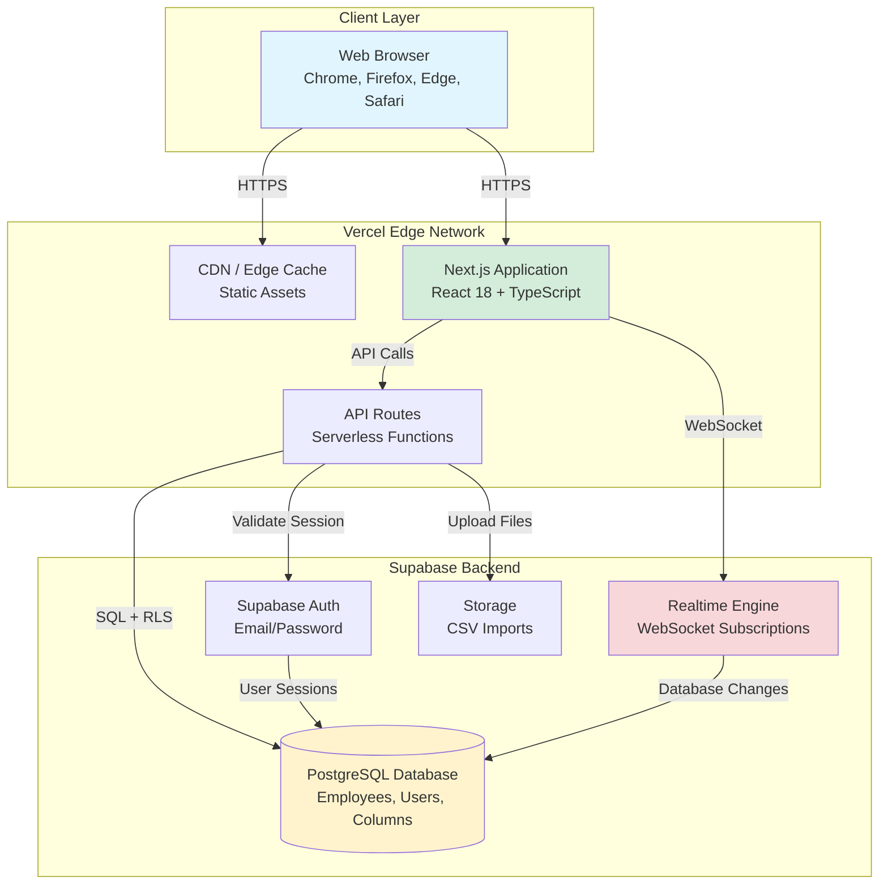

# High Level Architecture

## Technical Summary

The HR Masterdata Management System employs a **serverless monolith architecture** using Next.js App Router deployed on Vercel's edge network. The frontend leverages React 18 with TypeScript for type-safe component development, while API routes provide serverless backend functions that communicate with Supabase PostgreSQL database. Real-time data synchronization is achieved through Supabase's built-in real-time subscriptions, eliminating polling overhead and delivering sub-2-second latency for masterdata updates. Row-level security (RLS) policies in Supabase serve as the primary security enforcement mechanism, complemented by middleware-based authentication checks. This architecture maximizes free-tier infrastructure benefits while providing enterprise-grade security, scalability to 10,000+ records, and excellent developer experience through shared TypeScript types between frontend and backend.

## Platform and Infrastructure Choice

**Platform:** Vercel + Supabase  
**Key Services:**
- **Vercel**: Frontend hosting, serverless API routes, edge network CDN, automatic deployments
- **Supabase**: PostgreSQL database, authentication (email/password), real-time subscriptions, row-level security, storage
- **Vercel Analytics** (optional): Performance monitoring
- **Sentry** (post-MVP): Error tracking and monitoring

**Deployment Host and Regions:** Vercel Edge Network (global), Supabase hosted in closest available region (suggest US East or EU West based on user location)

**Rationale:**
1. **Cost**: Both platforms offer generous free tiers that meet PRD requirements (zero monthly operational cost)
2. **Developer Experience**: Seamless integration between Next.js and Supabase with excellent TypeScript support
3. **Real-time Capability**: Supabase provides built-in real-time subscriptions (critical for FR11: <2s sync latency)
4. **Security**: Supabase RLS provides database-level security enforcement (meets NFR10)
5. **Scalability**: Serverless architecture scales automatically with usage
6. **Time-to-Market**: Integrated auth, database, and API layer accelerates MVP delivery

**Alternative Considered:**
- **AWS Full Stack** (Amplify/AppSync + Lambda + Cognito + RDS): More complex setup, higher operational overhead, costs exceed free tier quickly
- **Firebase**: Limited SQL querying capabilities, less suitable for complex relational data

## Repository Structure

**Structure:** Monorepo (Single Repository)  
**Monorepo Tool:** Next.js built-in monorepo support (no additional tooling needed for MVP)  
**Package Organization:**

`
hr-masterdata/
 src/
    app/              # Next.js App Router pages and API routes
    components/       # Shared React components
    lib/              # Shared utilities, types, services
    middleware.ts     # Auth and routing middleware
 public/               # Static assets
 supabase/             # Database migrations and seed data
 tests/                # Test files
`

**Rationale:**
- Next.js App Router natively supports collocated frontend and backend code
- For MVP scope (5 epics, ~1,000 employees), a simple structure is sufficient
- Shared TypeScript types between frontend/backend naturally reside in src/lib/types/
- **Future Enhancement**: If project grows significantly, consider splitting into packages (packages/web, packages/api, packages/shared) using Turborepo or nx

## High Level Architecture Diagram

**Key Architecture Flows:**

1. **Initial Page Load**: Browser  CDN (static assets) + Next.js SSR (server-side rendering)
2. **Authentication**: Login form  API Route  Supabase Auth  Session Cookie
3. **Data Fetch**: React Component  API Route  PostgreSQL (with RLS enforcement)
4. **Real-time Updates**: PostgreSQL Change  Supabase Realtime  WebSocket  React Component Update
5. **CSV Import**: File Upload  API Route  Parse CSV  Batch Insert  PostgreSQL

## Architectural Patterns

- **Serverless Monolith:** All backend logic deployed as serverless functions via Next.js API routes on Vercel. No traditional server infrastructure. _Rationale:_ Minimizes operational complexity, automatic scaling, zero-cost idle time, excellent for MVP with <10 concurrent users.

- **Row-Level Security (RLS) as Primary Auth:** Database-level security policies enforce data access rules rather than relying solely on application code. _Rationale:_ Defense-in-depth security model, prevents data leakage even if application code has bugs, meets NFR10 requirement.

- **Component-Based UI with shadcn/ui:** React components built with Radix UI primitives and Tailwind CSS styling (shadcn/ui pattern). _Rationale:_ Accessible components out-of-box (WCAG AA compliance), customizable without framework lock-in, excellent TypeScript support.

- **TanStack Table for Data Grid:** Excel-like table interface using TanStack Table library with virtualization support. _Rationale:_ Lightweight (25KB gzipped), headless design allows full UI control, built-in sorting/filtering, handles 1,000+ rows efficiently.

- **Optimistic UI Updates with Real-time Sync:** Frontend immediately updates UI on user actions, then syncs with backend and subscribes to real-time changes. _Rationale:_ Perceived performance improvement, meets <2s latency requirement, handles concurrent edits gracefully.

- **Repository Pattern for Data Access:** API routes use repository/service layer to abstract database queries. _Rationale:_ Testable business logic (can mock database), cleaner separation of concerns, easier to add caching later.

- **Shared Type Definitions:** Single source of truth for TypeScript interfaces shared between frontend and backend in src/lib/types/. _Rationale:_ Type safety across full stack, prevents API contract mismatches, excellent DX for AI agents.

- **JSONB for Dynamic Columns:** Custom columns for external parties stored as JSONB in party-specific tables (sodexo_data, omc_data, etc.). _Rationale:_ Flexible schema evolution without migrations, efficient indexing with PostgreSQL GIN indexes, native JSON querying support.

---
