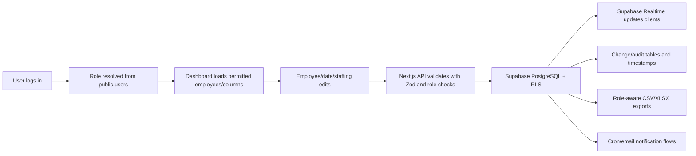

# System Overview

Prepared: 2026-06-03
Basis: repository evidence only.

## Purpose

HR Masterdata is a Swedish-only operational web application for Stena Line seasonal recruitment masterdata. It centralizes employee/candidate records and gives internal HR teams and external parties role-specific access to the same data source.

## Target Users

- HR Admin / HR Superuser
- Recruiter
- Admin Limited / Administratör
- Crewing
- Sodexo
- ÖMC
- Payroll
- Toplux

Evidence: `src/lib/types/user.ts`, `src/lib/utils/role-utils.ts`, `README.md`.

## Main Workflows

1. Login through Supabase Auth-backed same-origin API.
2. View employee dashboard with role-filtered columns and real-time updates.
3. HR/recruiter creates, imports, edits, terminates, archives, or reactivates employees.
4. External parties view permitted employee fields and manage permitted custom columns.
5. HR Admin manages users and column permissions.
6. HR/recruiter manages important dates, capacity, imports, and category/date exports.
7. Crewing/HR Admin updates staffing needs for Göteborg and Trelleborg.
8. Scheduled jobs send ÖMC and PE3 reminder emails.
9. Backup workflow dumps production data and refreshes staging partially.

## Core Domain Objects

- User: app-level user record linked to Supabase Auth.
- Employee: employee/candidate masterdata record with HR, training, payroll, room, diet, status, and checklist fields.
- Column Config: column metadata, display order, role permissions, category, and custom/masterdata marker.
- Important Date: Stena, ÖMC, PE3, and other scheduling records with capacity and assigned employees.
- Staffing Need: location headcount target and progress against crew-ready employees.
- Audit/Change: employee column changes and staffing target changelog.
- Saved Filter: per-user filter combinations.
- Notification Log: PE3 idempotency markers.

## Textual Domain Model

`auth.users` authenticates a person. `public.users` stores the application role and active status. A user reads or edits `employees` according to role and `column_config.role_permissions`. Employees may reference `important_dates` through `stena_date`, `omc_date`, and `pe3_date`. Staffing targets are stored per location in `staffing_needs` and changes are recorded in `staffing_needs_changelog`. External/user-specific view state can be stored in `user_filters`. Notification jobs query employees and important dates, then send emails and store idempotency state.

## Main Process

## Major Modules

| Module | Purpose | Users | Related data | Source evidence | Status |
| --- | --- | --- | --- | --- | --- |
| Authentication | Login, logout, current-user lookup, active-user checks | All users | `auth.users`, `public.users` | `src/app/api/auth/*`, `src/lib/server/auth.ts`, `middleware.ts` | Verified |
| Employee Dashboard | Primary table/card view, filters, realtime, role preview | All authenticated users | `employees`, `column_config`, `user_filters` | `src/app/dashboard/page.tsx`, `src/components/dashboard/*`, `src/lib/hooks/use-employees.ts` | Verified |
| Employee Lifecycle | Create, import, edit, terminate, archive, reactivate, anonymize | HR Admin, Recruiter, Admin Limited partly | `employees` | `src/app/api/employees/*`, `src/lib/server/repositories/employee-*` | Verified |
| Column Configuration | View/edit permissions, custom columns, display order, categories | HR Admin, external parties for own custom columns | `column_config`, real columns on `employees` | `src/app/api/admin/columns/*`, `src/app/api/columns/*`, `src/lib/server/repositories/column-config-repository.ts` | Verified |
| Important Dates | Date references, capacity, assignments, PE3 deadlines | HR Admin, Recruiter, all readers | `important_dates`, `employees` date references | `src/app/dashboard/important-dates/page.tsx`, `src/app/api/important-dates/*`, `src/lib/services/date-capacity.ts` | Verified |
| Room Assignment | ÖMC hotel room calculations | HR Admin, Recruiter workflows | `employees`, `important_dates`, RPC functions | `src/lib/services/room-assignment.ts`, `supabase/migrations/20251122150001_add_room_assignment_rpc.sql` | Verified |
| Staffing Needs | Göteborg/Trelleborg targets, progress, changelog, email | All view; HR Admin/Crewing edit | `staffing_needs`, `staffing_needs_changelog`, `employees` | `src/app/api/staffing-needs/*`, `src/lib/server/repositories/staffing-needs-repository.ts` | Verified |
| Notifications | ÖMC and PE3 reminders, staffing emails | HR/recruiter recipients | `employees`, `important_dates`, `pe3_notifications_log`, SMTP | `src/app/api/cron/*`, `src/lib/services/*notifications*`, `vercel.json` | Partially verified |
| Backup/Staging | Nightly dump, Supabase Storage upload, 14-day retention, partial staging refresh | Ops/maintainers | DB dumps, Supabase Storage | `.github/workflows/supabase-nightly-backup.yml`, `scripts/supabase-backup-storage.mjs` | Partially verified |
| Testing | Unit, integration, e2e, performance benches | Developers | Test fixtures | `vitest.config.ts`, `playwright.config.ts`, `tests/` | Verified by config |

## System Boundaries

Current implementation:

- Single Next.js app with App Router and API routes.
- Supabase is the database, auth provider, RLS engine, and realtime provider.
- SMTP/Nodemailer is used for email delivery.
- GitHub Actions handles CI and backup automation.
- Vercel cron is configured for two notification jobs.

Does not currently prove:

- Enterprise SSO/MFA.
- Formal customer tenant separation.
- Formal incident response process.
- Formal restore test evidence.
- Complete data retention policy.
- Production monitoring beyond logs/performance helper.
- That GDPR anonymization runs automatically in production.
