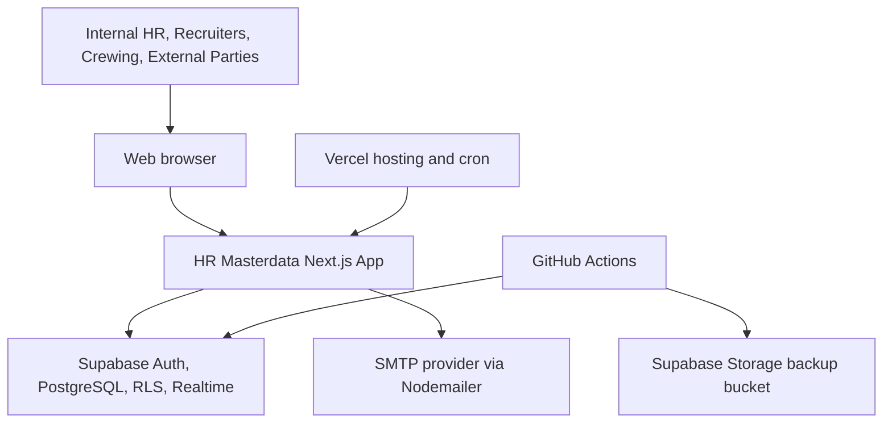
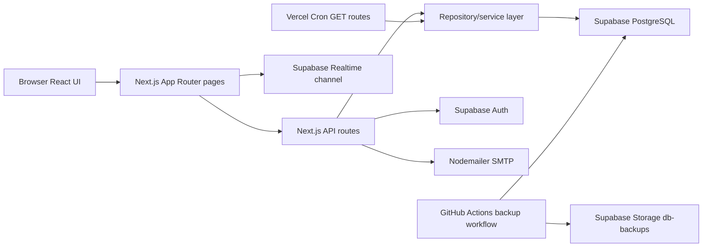
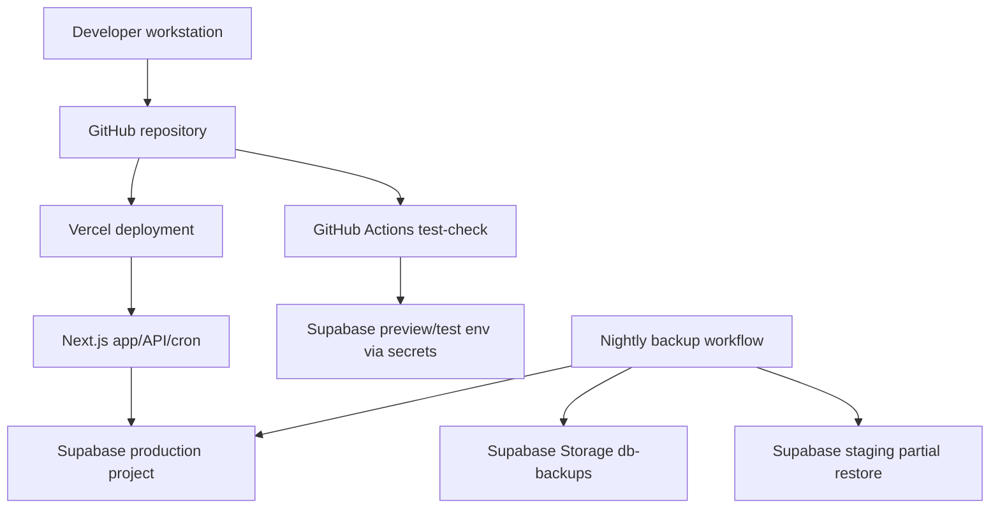
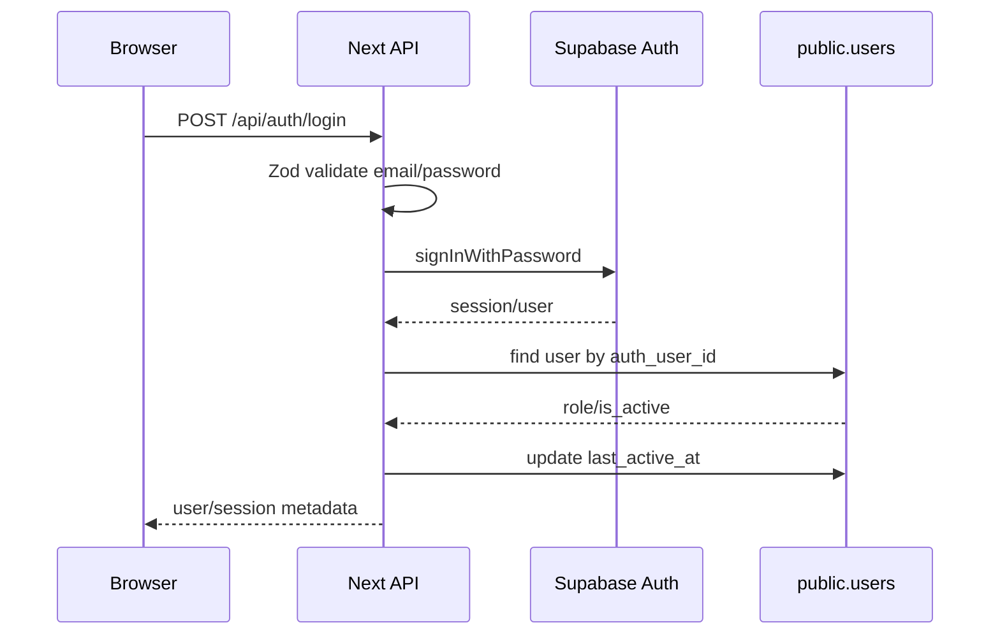
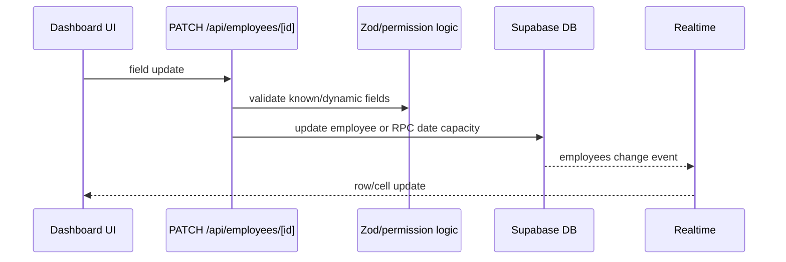
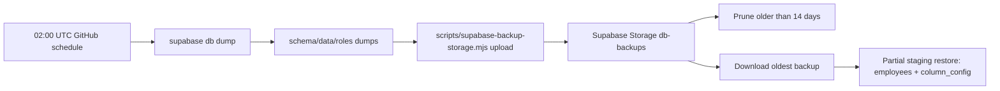

# Architecture

Prepared: 2026-06-03
Scope: C4-inspired architecture based on repository files plus sanitized GitHub, Vercel, and limited Supabase metadata verification.

## 1. System Context

Current implementation: the app is a serverless monolith using Next.js App Router. Evidence: `package.json`, `src/app`, `src/lib/supabase/*`, `vercel.json`.

Likely intent: Vercel hosts app/API/cron and Supabase provides data/auth/realtime. Evidence: `README.md`, `docs/architecture.md`, `.github/workflows/supabase-nightly-backup.yml`.

## 2. Container View

| Container | Responsibility | Technology | Evidence |
| --- | --- | --- | --- |
| Browser UI | Dashboard, tables/cards, modals, admin screens | React 19, TanStack Query/Table, Zustand, Radix/Tailwind | `src/app/dashboard/page.tsx`, `src/components` |
| API Layer | Authentication, validation, business operations, exports, cron endpoints | Next.js route handlers, Zod | `src/app/api`, `src/lib/validation` |
| Repository/Services | Data access and business workflows | TypeScript modules | `src/lib/server/repositories`, `src/lib/services` |
| Database/Auth | Relational data, RLS, auth sessions, realtime | Supabase PostgreSQL/Auth/Realtime | `supabase/migrations`, `src/lib/supabase` |
| CI/Backup | Tests, backups, staging refresh | GitHub Actions, Supabase CLI, Node script | `.github/workflows` |

## 3. Component View

| Component | Responsibility | Input/Output | Data read/written | Security considerations | Evidence |
| --- | --- | --- | --- | --- | --- |
| `middleware.ts` | Route redirects and admin route protection | Requests/cookies -> redirects/next response | `users.last_active_at` | API routes are explicitly skipped; API must self-protect | `middleware.ts` |
| `src/lib/server/auth.ts` | Server/API auth and role helpers | Supabase session -> `SessionUser` or error | `users` | Uses `getUser()` and active-user checks; some route calls omit request despite API cookie workaround | `src/lib/server/auth.ts` |
| Employee API | Employee CRUD/import/export/lifecycle | JSON/CSV -> employee data or files | `employees`, `important_dates`, `column_config` | Role checks and Zod; service role used in selected flows | `src/app/api/employees/*` |
| Column APIs | Column config CRUD/permissions | JSON -> column configs | `column_config`, `employees` real columns | Dynamic SQL is in validated RPC; admin/user endpoints differ | `src/app/api/columns/*`, `src/app/api/admin/columns/*` |
| Notification jobs | Reminder evaluation and emails | Cron GET -> email and log/marker changes | `employees`, `important_dates`, `pe3_notifications_log` | `CRON_SECRET` expected in production; service role queries | `src/app/api/cron/*`, `src/lib/services/*notification*` |
| Realtime hook | Subscribe to DB changes and update UI | Postgres changes -> UI state | `employees` realtime feed | Relies on Supabase realtime/RLS behavior | `src/lib/hooks/use-realtime.ts`, `src/lib/hooks/use-employees.ts` |

## 4. Deployment View

Current deployment evidence:

- `vercel.json` contains two cron paths: `/api/cron/omc-masterdata-reminder` and `/api/cron/pe3-deadline-notifications`.
- `.github/workflows/test-check.yml` runs type-check, lint, unit tests, and integration tests on `main` and `staging`.
- The latest checked staging revision had successful `Test Check` and `Main Promotion Source` workflow runs. The `Test Check` job completed checkout, package setup, dependency install, type check, lint, unit tests, and integration tests successfully.
- Branch protection was verified for `staging` and `main`. Both require strict status checks; `staging` requires `Run Tests`, and `main` requires `Run Tests` plus `Validate main promotion source`.
- The checked Vercel production deployment was `READY`, sourced from the expected GitHub release branch, and used the configured Next.js/Node runtime. Concrete project IDs, deployment IDs, commits, and region details are held privately.
- Vercel build logs for the checked production deployment show a successful compile/build and dynamic server usage warnings for admin pages that use cookies during static generation.
- Private unauthenticated endpoint checks found inconsistent pre-remediation protection between runtime hostnames. Story 22.1 removed the diagnostic route handlers; post-deployment production runtime verification remains pending.
- `.github/workflows/supabase-nightly-backup.yml` dumps production, uploads to Supabase Storage, prunes after 14 days, and partially restores `employees` and `column_config` to staging. The latest scheduled run checked on 2026-06-03 succeeded through upload, prune, download, and partial restore steps.
- Vercel CLI `54.7.1` is installed locally and Vercel project/deployment/log inspection was verified through the Vercel connector.
- Supabase CLI project access confirmed production and staging project metadata. Concrete project names, references, and regions are held privately.
- Production and staging Supabase REST schema metadata confirmed expected core public tables and eight RPC paths exist. No application rows were read.
- Staging/prod schema drift was identified in `employees`: staging has `asdas` and `testerere`, while production has `seably_security`, `seably_cyber`, `seably_crowd`, `seably_food`, and `seably_prm`.
- Supabase project controls were checked through the CLI and require private hardening review. Detailed control-state evidence is held privately.
- Direct RLS policy definitions, Auth settings, and migration history were not verified. Supabase MCP still lacks access to the HR project refs. Current global CLI is `2.54.10`; `npx supabase@2.104.0` exposes `db query`/`db advisors`, but linked queries fail because Supabase cannot alter the temporary CLI login role and requests `SUPABASE_DB_PASSWORD`.

## 5. Runtime Flows

### Login Flow

Security note: Supabase session cookies are managed by `@supabase/ssr`. The client also persists app user metadata in Zustand localStorage (`src/lib/store/auth-store.ts`).

### Employee Update Flow

### Backup Flow

## Architectural Strengths

- Single stack reduces operational complexity.
- TypeScript strict mode and shared types improve maintainability.
- RLS policies exist for major tables.
- API routes generally use server-side role checks and Zod validation.
- Business workflows are separated into repositories/services.
- Realtime and optimistic update logic are explicit.
- CI and backup automation are present.

## Architectural Risks

- Pre-remediation diagnostic endpoints existed in code and private checks found unauthenticated production runtime behavior. Story 22.1 removed the route handlers; release verification remains pending after deployment.
- API route protection depends on each route; middleware intentionally skips `/api/*`.
- Service-role bypasses require strict code review and logging discipline.
- Some route handlers call `requireAuthAPI()` without passing the `NextRequest`, despite a documented Next.js 16 cookie workaround.
- Selected export now uses real employee-table columns for custom-field export; keep this covered by regression tests.
- `employee_column_changes` exists in production and staging REST schema metadata, but its creation migration is not visible in tracked `supabase/migrations`; later migrations assume it exists.
- GDPR anonymization endpoint is not scheduled in `vercel.json`.
- Vercel build logs include `DYNAMIC_SERVER_USAGE` warnings for admin pages that use cookies during static generation.
- Managed database SSL/network controls were verified in Story 22.8 and are formally risk-accepted with documented hardening steps (review 2026-09-30).
- Physical backup/PITR posture is risk-accepted (PITR not enabled, review 2026-09-30); the GitHub logical backup workflow is the verified mechanism.
- Staging/prod schema drift means staging is useful for workflow testing but not a strict production schema mirror.
- Production monitoring is not verified from code or platform metadata; a full restore drill was verified on 2026-06-11 (`evidence/restore-drill-2026-06-11.md`), with backup-failure alerting still missing (Story 22.12).

## Recommended Improvements Before Enterprise Use

1. Remove/protect debug and test endpoints.
2. Keep dependency advisory evidence current; critical/high production advisories were patched by Story 22.3, with residual moderate/low advisories risk-accepted in `15_dependency_advisory_risk_register.md`.
3. Audit every API route for `requireAuthAPI(request)`/role helper usage.
4. Confirm DB migration history and hosted RLS policies directly in Supabase with database-password access, and keep export custom-field access on the real-column model.
5. Keep periodic restore drills (first full drill verified 2026-06-11) and formalize backup-failure alerting, incident response, logging redaction, and access reviews.
6. Consider migrating Vercel config management to a reviewed configuration workflow; deployment metadata and logs were inspected, but environment scopes/values should remain controlled and separately reviewed.
