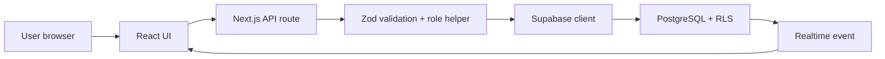
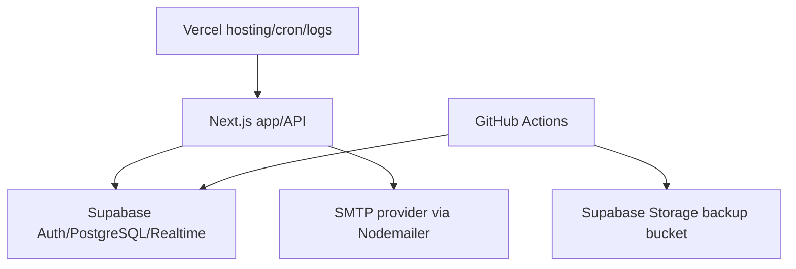
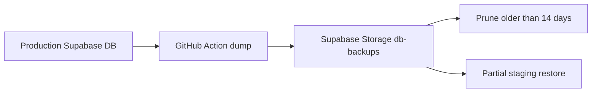
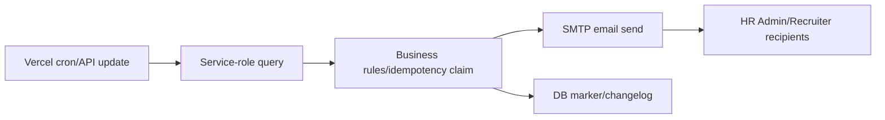

# Data Inventory And Data Flows

Prepared: 2026-06-03
Privacy note: this is a technical inventory, not legal advice.

## Data Inventory

| Data object/table | Description | Example fields | Personal data? | Potentially sensitive? | Source | Storage location | Who has access? | Retention/deletion | Shared with third party? | Code/schema evidence | Comment |
| --- | --- | --- | --- | --- | --- | --- | --- | --- | --- | --- | --- |
| `users` | App users and roles | email, role, is_active, auth_user_id, last_active_at | Yes | Yes | HR Admin/admin API | Supabase PostgreSQL | User self, HR Admin, service role | Deactivate/delete supported; audit retention unknown | Supabase Auth | initial schema, `src/app/api/admin/users/*` | User offboarding policy needed |
| `auth.users` | Supabase Auth accounts | email, password hash, session metadata | Yes | Yes | Supabase Auth | Supabase Auth | Supabase/admin service role | Supabase-controlled; settings not verified | Supabase | `src/app/api/auth/login/route.ts` | Password hashing provided by Supabase, not directly visible |
| `employees` | Core employee/candidate masterdata | name, SSN, email, mobile, rank, gender, dates, comments, diet, payroll-related flags, room | Yes | Yes | HR import/forms/API | Supabase PostgreSQL | Role/RLS/app column permissions | Archive, terminate, hard delete route, anonymize function after 3 months archived | Exports/email/backups | initial schema, employee types/routes | Highest privacy impact table |
| Real custom columns on `employees` | Partner-specific columns added dynamically | configurable typed columns | Yes/Unknown | Unknown | HR Admin | Supabase PostgreSQL | HR-only lifecycle; assigned-role value permissions in app | Column config can be deleted by HR Admin; physical column drop policy remains operator-controlled | Exports/backups | `column-config-repository.ts`, `create_employee_column_config` | Requires governance over new fields |
| `column_config` | Column metadata and role permissions | column name, db column name, role_permissions | May include business metadata | Low/medium | HR Admin; assigned users for limited presentation edits | Supabase PostgreSQL | Read broadly; active-HR-only lifecycle RLS; checked presentation service path | Lifecycle via HR admin APIs; assigned presentation fields only via external PATCH | Exports and administration | migrations, admin/assigned column routes | Direct external writes and lifecycle delete are denied; Story 22.1 removed the risky diagnostic handlers |
| `important_dates` | Operational scheduling dates | category, date_value, deadlines, capacity, assigned employees | Assigned employee JSON may include personal data | Yes | HR/recruiter | Supabase PostgreSQL | Authenticated users; HR/recruiter writes | Delete supported; assignment clearing | Emails/exports/backups | `create_important_dates`, `date-capacity.ts` | Assigned employees array includes name/email |
| `employee_column_changes` | Employee field change tracking | employee_id, column_name, changed_at, changed_by | Yes by reference | Yes | DB trigger | Supabase PostgreSQL | Authenticated users per later RLS policy | Retention unknown | Dashboard notifications | trigger/RLS migrations, Supabase REST schema metadata | Table exists in production and staging metadata; creation migration not visible in current `supabase/migrations` |
| `staffing_needs` | Headcount targets by location | location, headcount_need, updated_by | User reference only | Low | HR Admin/Crewing | Supabase PostgreSQL | All authenticated read; HR Admin/Crewing update | No deletion expected | Email notifications/backups | migration 20260313000001 | Low privacy |
| `staffing_needs_changelog` | Staffing target audit | old/new values, changed_by, changed_at | User reference | Low/medium | API/RPC | Supabase PostgreSQL | All authenticated read | Current-year UI; DB retention unknown | Emails/backups | staffing migrations | Audit retention policy needed |
| `user_filters` | Saved filter state | user_id, name, filters JSON | Could reveal work patterns | Medium | User API | Supabase PostgreSQL | Own user by RLS | User delete API | Backups | migration 20260130212612 | Filters may reference sensitive fields |
| `pe3_notifications_log` | Idempotency markers | deadline_type, deadline_date, sent_at | No direct personal data | Low | Cron service | Supabase PostgreSQL | Service role; RLS enabled without visible policies | Retention unknown | Backups | migration 20260520000000 | Operations log |
| SMTP emails | Notification content | names, missing fields, staffing changes, date info | Yes in ÖMC/PE3 reminders | Yes | Notification services | SMTP provider/mailboxes | Recipients/provider | Mailbox/provider retention unknown | SMTP provider | `email-service.ts`, notification services | Needs DPA/retention review |
| Logs | Console/Vercel/GitHub logs | emails, user ids, employee ids, errors | Potentially | Yes | App/CI/runtime | Vercel/GitHub/local | Maintainers/platform | Unknown | Platform providers | `rg console.* src` | Redaction policy needed |
| Backups | DB dumps | production schema/data | Yes | Yes | GitHub Actions and private platform backup metadata | Supabase Storage backup bucket plus managed-platform backup posture | GitHub/Supabase privileged access | 14-day workflow variable for logical backups | Supabase/GitHub | `.github/workflows/supabase-nightly-backup.yml`, GitHub run metadata, private platform backup metadata | Latest scheduled logical backup and partial staging restore verified; managed-platform backup/PITR posture risk-accepted 2026-06-11 (PITR not enabled; review 2026-09-30); full restore drill verified 2026-06-11 (`evidence/restore-drill-2026-06-11.md`) |

## Data Flow: User To Database

## Presentation Data Scope

Production employee data may be shown in an external presentation when the presenter follows the standing controls in `16_presentation_data_scope_and_access_preconditions.md`: use a normal named app account, stay within the demonstrated role context, control the employee population and visible field categories, and keep exports, screenshots, browser history, recordings, transcripts, AI notes, tabs, and downloads under presenter control.

Population scope should be described by a business selection rule such as season, route, department, role, status, or manager-owned population when discussing the presentation. The readiness evidence must not include raw employee examples, raw SSNs, access tokens, cookies, database URLs, or secret values. Story 22.2-compliant isolated non-production paths are used only when a synthetic or isolated demonstration is deliberately chosen.

## Data Flow: External Services

## Backup Flow

## Notification Flow

## Retention And Deletion

Current implementation:

- Employees can be archived and unarchived.
- Employees can be terminated/reactivated.
- A GDPR anonymization API masks selected fields for archived employees older than three months.
- HR Admin/recruiter hard-delete route exists for employees (`DELETE /api/employees/[id]`).
- User filters can be deleted by owner.
- Column configurations can be deleted; physical employee columns may remain unless separately migrated.
- Backups are pruned after 14 days in current GitHub workflow.
- Managed-platform physical backup/PITR posture requires private operations review, so the public verified backup evidence is the GitHub logical backup workflow.

Unknown/needs confirmation:

- Legal retention period for employee masterdata.
- Whether hard delete is allowed under business/legal rules.
- Whether anonymization should include email, town/district, date assignments, and custom columns.
- Whether deletion from backups is handled only through backup expiration.
- Whether logs contain personal data and how long platform logs are retained.
